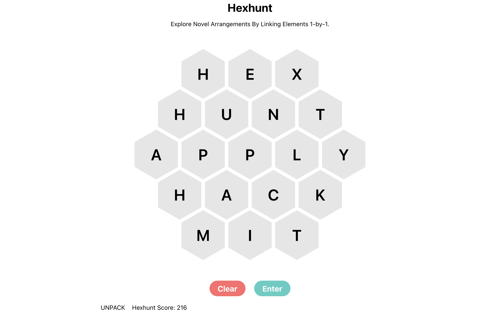
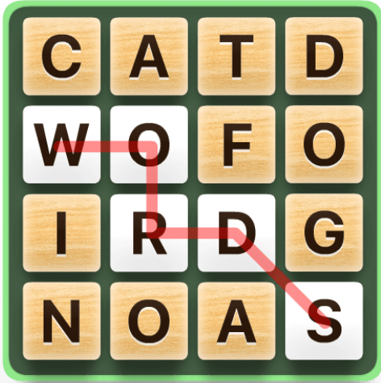
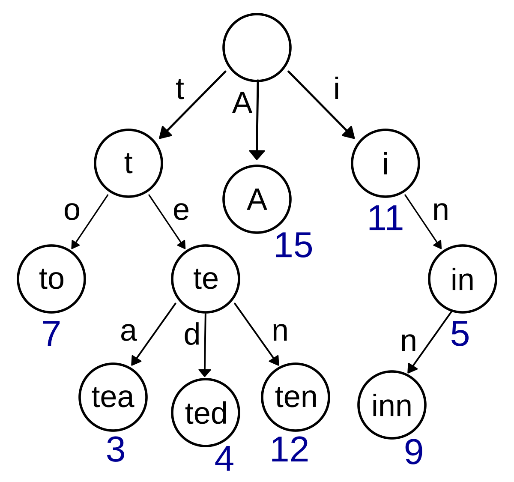
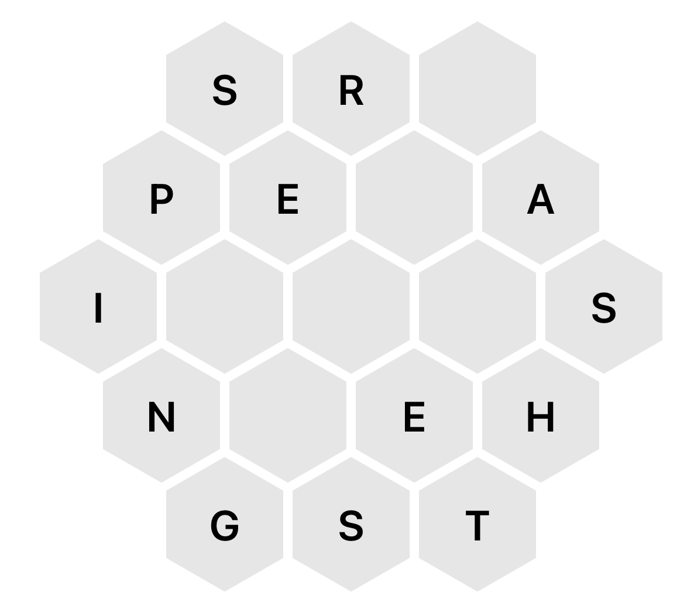
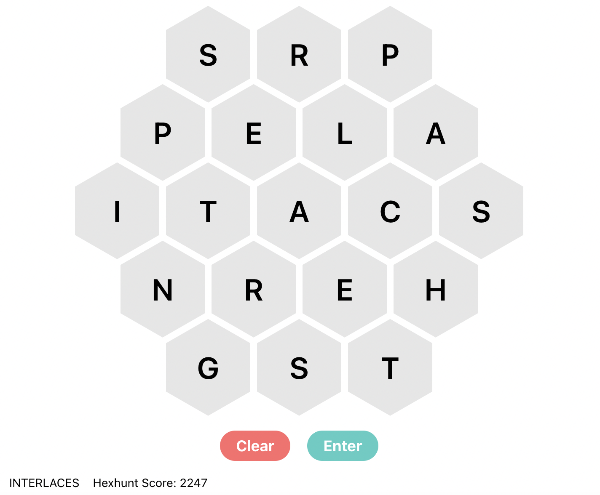
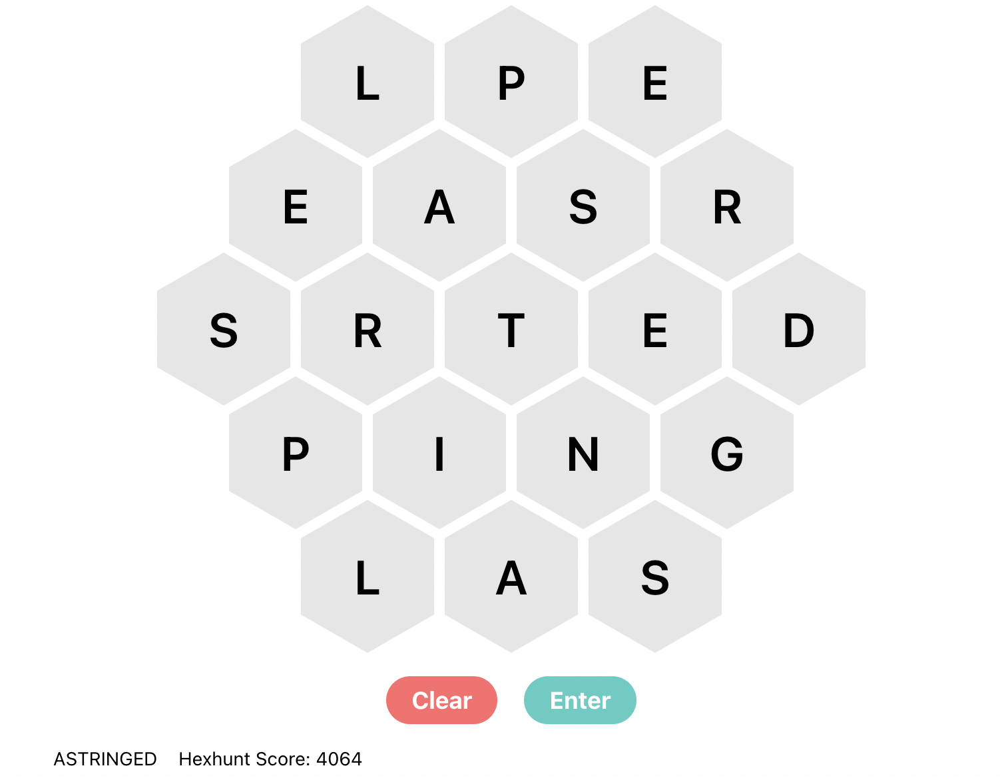

# Creating and Defeating Hexhunt

<style>
.header-container {
    display: flex;
    justify-content: space-between;
    align-items: center;
    width: 100%;
}
</style>


<div class="header-container">
    <div class="header-left">Adam Zweiger</div>
    <div class="header-right">August 17, 2024</div>
</div>

---

## Introduction

This HackMIT admission cycle, our dev team made [HackTimes](https://hacktimes.hackmit.org/), an [NYT-Games](https://www.nytimes.com/crosswords)-themed series of 6 puzzles where the top 50 solvers would earn automatic admission to the hackathon.

In this post, I'll explain my puzzle Hexhunt and walk through a few nice solutions. It's a fairly natural question that came up from a simple word game that leads to many interesting algorithms and techniques from ML in order to solve it. 

If you would like to try the puzzle first, visit [HackTimes](https://hacktimes.hackmit.org/) and login with Github. Alternatively, you can use [this guest account](https://hexhunt.hackmit.org/u/guest_5f45d1c9) without logging in. Note that the website requires the token at the end of the URL to respond, and your queries might not get responses if too many others are using the rate-limited guest account.




## Deciphering the Puzzle

At first glance, the puzzle's objective isn't clear. The page allows for inputting 19 letters (A-Z) and then outputs a word and a score. The goal, presumably, is to maximize this score. After some experimentation, we notice a few observations:
- Orientation of the board doesn't matter
- You can get the same outputted word with different scores and different outputted words with the same score
- The outputted word appears to be the longest word that can be produced by connecting adjacent letters without repeats

From that and more playing around with different inputs, it can be deduced that the score is related to the set of all words that can be produced by connecting adjacent letters on the board. Writing a program that finds every such word is helpful in determining exactly what the scoring mechanism is. It's still possible to get a very high score without knowing exactly what the scoring function is, but much harder. 

With enough trial and error, especially with the help of a program, it can be determined that score is likely the sum of the lengths of all words that can be produced by connecting adjacent letters.

## Inspiration

This puzzle was inspired by my friend and I playing a high-scoring game of Word Hunt. For those unfamiliar, Word Hunt is a game based on [Boggle](https://en.wikipedia.org/wiki/Boggle), integrated into Apple's iMessage. It presents the player a 4x4 grid of letters, and the goal is to combine these letters adjacently (including diagonally), without repeats, to form words. These words add to your overall score according to their lengths.




A natural question arose: **what’s the highest-scoring board of Word Hunt possible?** This is what Hexhunt is about, but on a hexagonal board to avoid the use of existing Word Hunt solvers online[^1]. Here is a complete problem description:

---

- *A Hexhunt board is a symmetric 19-hexagon grid of letters*
- *Words can be formed on the board by connecting adjacent letters without repetition*
- *Valid words must be included in the ENABLE1 corpus[^2]*
- *A Hexhunt board's score is the sum of the lengths of all unique words that can be formed on the board*


*Find the Hexhunt board with the highest score you can.*

---

## Evaluation

The key to solving a lot of computational problems lies in efficient automated evaluation. Any task that you can make a good quantitative automated evaluation for is essentially solved. This is why we have superhuman bots for chess, poker, and many video games, but still no LLM that can write a good essay; the next-word-prediction task and RLHF both rely on external data for evaluation, while games have the automated evaluation of whether you win or lose under the constraints of the system. So, let's figure out how to do automated evaluation for Hexhunt.

Many attempted to use automated requests to our puzzle's website or API, but we implemented rate-limiting to around one query per account per 3 seconds. Because of that, it's practically required to replicate the evaluation implementation yourself in order to get the top score(s).

The naive approach is to use DFS or BFS to find every possible string of letters you can spell out, and then checking if each word is in the corpus. However, this is slow because we need to search and verify every single string up to a certain length, when we should be able to backtrack after beginning with a prefix that doesn't lead to any valid words. The speed of our website's responses to queries suggests a much faster approach is possible.

The solution is to use a trie to represent the set of valid words. A trie is a prefix tree data structure that stores strings for efficient indexing. 

<figure>
    
    <figcaption style="width: 85%; margin: auto;"> An example of a trie representation of a wordlist. Nodes next to blue numbers correspond to the ends of valid words. In our code, rather than directly indexing nodes with numbers, as in the image, we just have "TrieNodes" that point to their children and have a boolean attribute of whether it represents the end of a valid word. Image from <a href="https://en.wikipedia.org/wiki/Trie">Wikipedia</a>. </figcaption>
</figure>

By storing the set of words in this way, we can significantly reduce computation during the DFS. We pass a pointer to a node on the trie during our DFS, and only traverse paths that are represented on the trie. Implementing this in Python reduces the time to check a board's score to around a millisecond ([See code](#eval)). Using a faster compiled language like C(++) can make this much faster, but we will present code in Python for clarity.

Now that we have a fast eval, we can begin our search for high-scoring boards.

## Solution

The crux of the puzzle is the search. With 19 spaces for letters, there are $26^{19} \approx 7\cdot 10^{27}$ different possible Hexhunt boards, and we aim to find the single highest scoring one. Eliminating rotations and reflections doesn't make it much easier.

So how do we maximize this scoring function over a search space that’s too large to brute force? There are many interesting approaches. 

### Mini complete search

We can actually reduce the search space considerably based on intuitive heuristics of what a high-scoring board might look like. For example, we can ignore uncommon letters in English, fix some vowels, place some e's next to s's and r's. Then, we can run a complete search on a much smaller space.



For example, fixing the above arrangement of nicely paired letters and doing a complete search, letting the other letters vary over some frequently seen letters, "AEIOCDLNPRST," yields a score of 2247 in a little under an hour of Python computation:



We can't really expect this to give the highest possibly score given how much we have to fix constant in order to keep computation time low. However, trying out mini complete searches on various partial boards can do a lot better than trying to manually build entire boards based on intuition.

### Random Sampling and Hill Climbing

One of the other simplest approaches is to repeatedly sample 19 random letters until finding a high-scoring board. However, this method isn't very effective, even when restricting the space as we did earlier, because it doesn't use previous results to inform later attempts.

Instead, many good solutions rely on taking existing boards or randomly generated boards and then modifying them to produce higher scores. One easy way to get a relatively high score is to randomly generate a board and then repeat the following:
- Make a random single-letter modification
- Accept the new board if it scores higher, otherwise keep the old one

By "single-letter modification," I mean randomly taking one of the 19 spots on the board and then replacing it with a randomly generated letter. It's also possible to do this method without any randomness by generating every single-letter-adjusted board and then taking the highest-scoring board out of that list.

Repeatedly doing this method on different random starting boards can consistently give scores in the 3000s in just a few minutes to hours of computing time.

As a sidenote, we can think of the space of possible boards as a set of $26^{19}$ nodes on a graph, with edges connecting adjacent boards, for some definition of adjacent. For example, in the previous approach, we defined adjacent as "differing by a single-letter modification," creating a [Hamming graph](https://en.wikipedia.org/wiki/Hamming_graph). This is a graph where adjacent nodes are off by a Hamming distance of 1. We then performed a (random) walk on this graph, increasing our score with each movement.

<figure>
    
    <figcaption style="width: 85%; margin: auto;"> Examples of small Hamming graphs H(d, q), which are graphs on sequences of length d in base q, with edges between nodes of Hamming distance 1. Our hill climbing and simmulated annealing approaches do random walks on H(19, 26), or H(19, n) if we want to only consider a list of n&lt;26 common letters. Image from <a href="https://mathworld.wolfram.com/HammingGraph.html">Wolfram Mathworld</a>. </figcaption>
</figure>

### Simulated Annealing

The main issue with naive hill climbing is that we get stuck in local maxima. Often, no single-letter modification yields a better score, but swapping two letters on the board or making some other 2-letter or 3-letter modification does. 

Some solvers tried to address this by coding the ability to sample boards that swap nodes or make two-letter modifications. In other words, they tried expanding the definition of adjacent boards. I'm not sure exactly how well this works, but the problem with this is that the number of adjacent boards grows too quickly. Considering two-letter modifications increases the degree of each node on our graph from $26\cdot 19=494$ to around $494^2 \approx 2.4\cdot 10^6$. 

To overcome the issue of getting stuck in local maxima without drastically increasing computational complexity, we can draw inspiration from Markov chain Monte Carlo methods like the Metropolis–Hastings algorithm, where worse candidate values are accepted with a certain acceptance probability. We will use a generalization of hill climbing that does just that, known as [simulated annealing](https://en.wikipedia.org/wiki/Simulated_annealing).

Simulated annealing works by allowing moves to worse-scoring boards with a certain probability that decreases over time and depends on the magnitude of the decrease in score. This probability is controlled by a parameter called "temperature," which starts high and gradually decreases or "cools" as the algorithm progresses.
Here's how it works in the context of Hexhunt:

1. Start with a random board and set an initial high temperature.
2. Repeatedly:
   - Generate a random neighboring candidate board by making a small change (e.g., a single-letter modification).
   - If the candidate has a higher score, always accept it.
   - If the candidate has a lower score, move to it with a probability that depends on:
     * How much worse the new score is
     * The current temperature
   - Decrease the temperature slightly.
3. Stop when the temperature reaches a predetermined low value or when no improvements have been made for a certain number of iterations.

The key idea of simulated annealing is that at high temperatures, the algorithm is more likely to accept worse moves, allowing it to explore the search space more freely and potentially escape local maxima. As the temperature decreases, the algorithm becomes more selective, eventually converging on a good local maximum in the vicinity of where the random walk ended up.

The probability of accepting a worse move is calculated with the expression: $P(\text{accept}) = e^{-\frac{\Delta E}{T}}$, where $\Delta E$ is the change in score (negative for worse moves) and $T$ is the current temperature.

This approach allows us to escape maxima that simple hill climbing gets stuck in early on. It explores the search space more thoroughly, naturally balancing exploration (at high temperatures) and exploitation (at low temperatures).

Simulated annealing is especially powerful when applied multiple times to various starting boards, including both randomly generated ones and strong boards produced by previous methods. The speed at which we can achieve high scores largely depends on how well we can fine-tune the model parameters, like the starting temperature, cooling rate, and number of iterations. With good parameters, we can achieve scores above 3500 within minutes.

[Here](#SA) is our code with the values that we used. It runs 10,000 iterations for each of 300 randomly generated boards, taking about an hour to run in full, and has a good chance of reaching the highest possible score during that time.


### Other methods

There are all sorts of techniques that are similar to hill climbing and simulated annealing like [Tabu search](https://en.wikipedia.org/wiki/Tabu_search), which allows for worsening moves if no improving move is possible, and assigns "taboo" for returning to previously seen boards. It's not clear to me which method would be best with a larger search space, but with our relatively small problem, most variants of hill climbing that address the local maxima issue can yield very high scores.

Apparently, some people also had success with genetic algorithms. These repeatedly take the best of many randomly generated boards and make random mutations like single-letter modifications or swaps, and then recombine boards together in different ways to create better boards. While I haven't tried these methods out, my intuition is that most of the benefits from recombination would occur earlier on, while achieving higher scores later on mostly comes from the mutations, which are the same sort of mutations as in normal hill climbing or simulated annealing. But, perhaps this approach can work well with a good method for sampling possible recombinations.


## Conclusion

In the end, we got 1259 total submissions for this puzzle (solvers can submit multiple times for higher scores). Out of 1152 people who accessed the HackTimes page and attempted puzzles, 128 got a Hexhunt score higher than 2000. An impressive 28 of them got the same high score of **4064** with this board or one of its rotations/reflections:


There's likely no good way to prove mathematically that this is the highest scoring board without essentially doing an exhaustive search, but from the sheer number of people who tried their various techniques with many hundreds of hours of computation, and achieved the same highest score, we can be extremely confident that 4064 is the maximum possible Hexhunt score.


## Code

**Evaluation:** <a id="eval"></a>
```
# evaluation.py
class TrieNode:
    def __init__(self):
        self.children = {}
        self.is_end = False

class Trie:
    def __init__(self):
        self.root = TrieNode()

    def insert(self, word):
        node = self.root
        for char in word:
            if char not in node.children:
                node.children[char] = TrieNode()
            node = node.children[char]
        node.is_end = True

    def search_prefix(self, prefix):
        node = self.root
        for char in prefix:
            if char not in node.children:
                return False
            node = node.children[char]
        return True

def load_wordlist(filename):
    trie = Trie()
    with open(filename, 'r') as f:
        for line in f:
            word = line.strip().upper()
            trie.insert(word)
    return trie

def find_words(board, trie):
    def dfs(i, j, node, path, words):
        if i < 0 or i >= len(board) or j < 0 or j >= len(board[0]) or board[i][j]=='.' or (i, j) in path:
            return
        
        char = board[i][j].upper()
        if char not in node.children:
            return
        
        node = node.children[char]
        path.append((i, j))
        
        if node.is_end:
            words.add(''.join(board[x][y].upper() for x, y in path))
        
        for di, dj in [(0, 2), (0, -2), (-1, -1), (-1, 1), (1, -1), (1, 1)]:
            dfs(i + di, j + dj, node, path, words)
        
        path.pop()

    words = set()
    for i in range(len(board)):
        for j in range(len(board[0])):
            dfs(i, j, trie.root, [], words)
    return words

def convert_board(board): # Convert from string to array representation
    return [['.', '.', board[0], '.', board[1], '.', board[2], '.', '.'], 
            ['.', board[3], '.', board[4], '.', board[5], '.', board[6], '.'], 
            [board[7], '.', board[8], '.', board[9], '.', board[10], '.', board[11]], 
            ['.', board[12], '.', board[13], '.', board[14], '.', board[15], '.'], 
            ['.', '.', board[16], '.', board[17], '.', board[18], '.', '.']]

def solve_board(board, trie):
    words = find_words(board, trie)
    word_scores = {word: len(word) for word in words}
    return word_scores

def score_board(word_scores):
    return sum(word_scores.values())
```

**Simulated Annealing:** <a id="SA"></a>

```
# simulated_annealing.py
import os
from collections import defaultdict
import random
import math
from evaluation import load_wordlist, solve_board, convert_board

ALLOWED_LETTERS = "AEIOUBCDFGHLMNPRSTY"


def create_output_file(board, result, folder_name):
    # Creates <score>.txt in folder_name with Hexhunt board, score, and words found
    if not os.path.exists(folder_name):
        os.makedirs(folder_name)

    total_score = sum(result.values())
    filename = f"{folder_name}/{total_score}.txt"

    base_filename = filename
    suffix = 1
    while os.path.exists(filename):
        filename = f"{base_filename[:-4]}_{suffix}.txt"
        suffix += 1

    with open(filename, "w") as f:
        # Write board
        f.write("Board:\n")
        for row in board:
            f.write(" ".join(row) + "\n")
        f.write("\n\n")

        # Write score
        f.write(f"Total score: {total_score}\n")
        f.write("\n\n")

        # Write word list
        f.write("Words found:\n")
        words_by_length = defaultdict(list)
        for word, length in result.items():
            words_by_length[length].append(word)

        for length in sorted(words_by_length.keys(), reverse=True):
            for word in sorted(words_by_length[length]):
                f.write(f"{word}: {length}\n")

    print(f"Output file created: {filename}")


def generate_random_board():
    return convert_board(''.join(random.choices(ALLOWED_LETTERS, k=19)))

def modify_board(board):
    new_board = [row[:] for row in board]
    valid_positions = [
        (0, 2), (0, 4), (0, 6),
        (1, 1), (1, 3), (1, 5), (1, 7),
        (2, 0), (2, 2), (2, 4), (2, 6), (2, 8),
        (3, 1), (3, 3), (3, 5), (3, 7),
        (4, 2), (4, 4), (4, 6)
    ]
    r, c = random.choice(valid_positions)
    new_board[r][c] = random.choice(ALLOWED_LETTERS)
    return new_board

def temperature_schedule(t, T_max, T_min, iterations):
    return T_max * (T_min / T_max) ** (t / iterations)

def anneal(initial_board, trie, iterations=10000): # Run 10,000 iterations of SA
    current_board = initial_board
    current_score = sum(solve_board(current_board, trie).values())
    best_board = current_board
    best_score = current_score
    achieved_scores = set()

    T_max = 100  # Starting temperature
    T_min = 20  # Ending temperature

    for t in range(iterations):
        temperature = temperature_schedule(t, T_max, T_min, iterations)

        new_board = modify_board(current_board)
        new_score = sum(solve_board(new_board, trie).values())

        if t % 500 == 0: # print progress every 500 iterations to check annealing parameters are working well
            print(f"Iteration: {t}, Temperature: {temperature:.2f}, Current Score: {current_score}, New Score: {new_score}")
            for row in current_board:
                print(' '.join(row))

        if new_score >= 3500 and new_score not in achieved_scores: # Create a file for boards at or above a threshold of 3500
            create_output_file(new_board, solve_board(new_board, trie), "anneal")
            print(f"Created new file: {new_score}.txt")
            achieved_scores.add(new_score)

        # SA acceptance probability
        if new_score > current_score:
            acceptance_probability = 1.0
        else:
            acceptance_probability = math.exp((new_score - current_score) / temperature)


        if random.random() < acceptance_probability:
            current_board = new_board
            current_score = new_score

        if current_score > best_score:
            best_board = current_board
            best_score = current_score

    return best_board, best_score

if __name__ == "__main__":
    wordlist_file = "wordlist.txt"
    trie = load_wordlist(wordlist_file)

    for t in range(300): # 300 attempts
        print(f"ATTEMPT {t+1}\n")
        initial_board = generate_random_board()

        optimized_board, optimized_score = anneal(initial_board, trie)
        print("\nOptimized board:")
        for row in optimized_board:
            print(' '.join(row))
        print(f"Optimized score: {optimized_score}\n\n")
```

[^1]: There are many Github repos and sites online with automatic solvers for Word Hunt, but we also later discovered that this problem of maximizing the highest score had already been considered for the related game of Boggle [here](https://digitalcommons.butler.edu/cgi/viewcontent.cgi?article=2722&context=wordways) and [here](http://www.robertgamble.net/2016/01/a-programmers-analysis-of-boggle.html). I hadn't come across this despite a lot of searching before I made the puzzle since I hadn't searched using the keyword "Boggle." It's always unfortunate to discover that the problem you've been working on has already been solved and published. Nevertheless, I'm pretty sure no one has tried the hexagonal board before, and that none or close to none of the contestants got spoiled on any solving techniques from looking online. The highest scoring Word Hunt board using our scoring rules and ENABLE1 is likely this one, with a score of 6294: ``` S L P S \ E A I E \ R N T R \ G E S O ```

[^2]: You might wonder what counts as a valid word. Some people figured out the wordlist by testing popular corpora like SOWPODS and TWL, etc. until finding a match. Others realized that the first characters of the puzzle's cryptic description, "Explore Novel Arrangements By Linking Elements 1-by-1" spell out [ENABLE1](https://github.com/dolph/dictionary/blob/master/enable1.txt), a corpus used for many word games, including Word Hunt.
