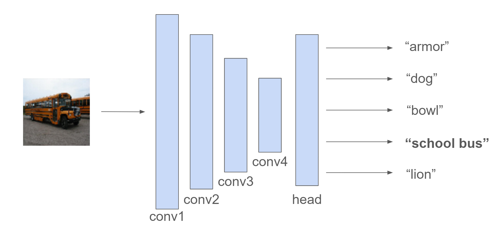
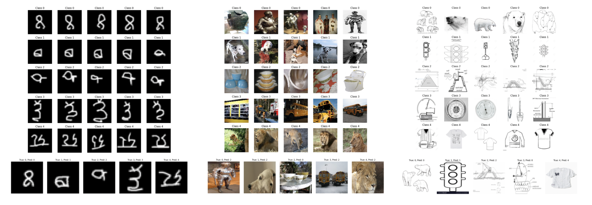
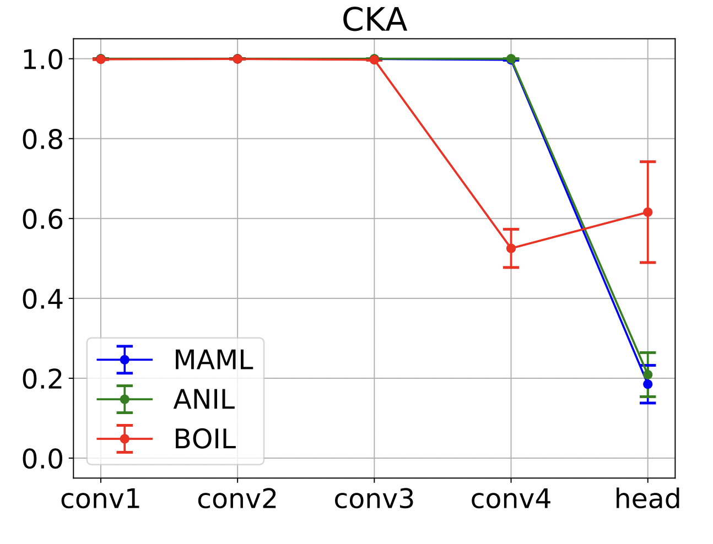

# Learning to Learn Across Domains

    
Janelle Cai and Adam Zweiger

    
December 10, 2024

---
## Introduction

Humans excel at learning new concepts from a very small number of examples. For instance, we can recognize a previously unseen handwritten character or identify a novel object category after just one or two glimpses. **Meta-learning** aims to equip machine learning models with this strong few-shot learning capability, enabling rapid adaptation to new tasks using minimal data.

Among various meta-learning approaches—model-based, metric-based, and optimization-based—**Model Agnostic Meta-Learning (MAML)** [(Finn et al., 2017)](#ref1) has emerged as a particularly influential method. MAML treats meta-learning as a bilevel optimization problem, learning parameters that can be quickly fine-tuned to new tasks. Building on MAML, two variants of its variants **ANIL** [(Raghu et al., 2020)](#ref2) and **BOIL** [(Oh et al., 2021)](#ref3) have explored whether performance hinges on reusing representations or rapidly learning them.

In this post, we examine these methods in depth, look at how different layers of a model contribute to adaptation, explain why ANIL and BOIL work well, and introduce a simple modification that often outperforms existing approaches. We evaluate generalization among these models across varying domain gaps on the Omniglot [(Lake et al., 2015)](#ref4), Mini-ImageNet [(Vinyals et al., 2016)](#ref5), and ImageNet-Sketch [(Wang et al., 2019)](#ref6) datasets, and discuss the enduring debate between feature reuse and rapid representation change.

### What is MAML?

The goal of MAML is to learn a set of parameters $\theta$ that can quickly adapt to a distribution of tasks $\tau$, including tasks never seen before. Each task $\tau$ has a small training set $\tau_{\text{train}}$ and a test set $\tau_{\text{test}}$. MAML seeks to minimize the loss over tasks from some distribution $p(\tau)$, where the loss on $\tau_{\text{test}}$ is computed after training $\theta$ on $\tau_{\text{train}}$:

$$
\argmin_\theta\,\mathbb{E}_{\tau\sim p(\tau)}[\mathcal{L}(\theta;\tau_{\text{train}},\tau_\text{test})].
$$

For each task $\tau \sim p(\tau)$, the model computes task-specific parameters $\theta_\tau^\prime$ via one or more gradient steps on $\tau_{\text{train}}$:

$$
\theta'_\tau = \theta - \alpha \nabla_\theta \mathcal{L}(\theta; \tau_{\text{train}}),
$$

where $\alpha$ is the inner loop learning rate. The meta-objective then updates $\theta$ using the performance of $\theta_\tau^\prime$ on $\tau_{\text{test}}$:

$$
\theta \leftarrow \theta - \beta \nabla_\theta \mathbb{E}_{\tau \sim p(\tau)}[\mathcal{L}(\theta'_\tau; \tau_{\text{test}})],
$$

where $\beta$ is the outer loop learning rate. Through this two-level optimization, which involves second-order gradients, MAML is trained globally to enable fast adaptation locally.

### Representation Change vs. Representation Reuse

The authors of **ANIL** (Almost No Inner Loop) [(Raghu et al., 2020)](#ref2) made an interesting discovery: by using **Centered Kernel Alignment (CKA)** [(Kornblith et al., 2019)](#ref7)—a method to measure similarity between neural network representations—they found that MAML's adaptation primarily occurs in the final layer of the network. Representations in earlier layers remain relatively unchanged, indicating that MAML's success largely comes from **representation reuse** rather than deep representation change. Motivated by this, ANIL simplifies MAML by freezing all but the last layer during the inner loop, yielding comparable performance. In other words, simply re-tuning the head on top of a stable body of features is sufficient.

The authors of **BOIL** (Body-Only Inner Loop) [(Oh et al., 2021)](#ref3) see this discovery and take the opposite perspective. They have the insight that this last-layer-only adaptation in MAML might not be desirable. Instead, they propose BOIL, which freezes only the final layer during the inner loop and allows deeper (earlier) layers to update. This encourages more substantial representation changes beyond just the final classifier layer, and ends up outperforming both MAML and ANIL, especially on tasks with large domain shifts. The takeaway from BOIL is that there are performance gains from *preventing* the model from relying on feature reuse, and that feature reuse alone is insufficient for strong meta-learning.

However, this raises new questions. Does preventing changes to the head layer merely push adaptation into the penultimate layer, rather than truly distributing it more widely? If so, is the penultimate layer truly optimal for adaptation, or can we do better with some other configuration of freezing layers? Do larger domain shifts necessitate inner-loop updates deeper in the network?

## Methods and Experiments

To investigate some of these questions, we conducted a series of experiments to understand how different layers and different domain shifts in the data influence task performance.

### Model Architecture

The experiments from the MAML, BOIL, and ANIL papers used the **Conv4** architecture in their experiments. Conv4 is a CNN with four convolutional layers that include max pooling, followed by a single layer fully-connected classifier head. To explore whether the penultimate layer (last convolutional layer) has unique significance, we also conducted experiments with a Conv6 architecture, which has six convolutional layers instead of four.

    
    <em>Figure 1: Visualization of the Conv4 architecture.</em>

### Datasets

We utilized a variety of datasets to test both within-domain and cross-domain generalization capabilities:

- **Omniglot:** A dataset of 1,623 handwritten black-and-white characters from 50 different alphabets with 20 examples per character. Dubbed the “transpose” of MNIST.
- **Mini-ImageNet:** A smaller subset of the ImageNet database, consisting of 50,000 color images across 100 classes.
- **ImageNet-Sketch:** A sketch-based variant of ImageNet containing 50,000 images across 1,000 classes. These images, sourced from Google, feature sketch-like representations of objects. While primarily black-and-white, some images include a bit of color from their original source.

    
    <em style="display: block; max-width: 85%; margin: 0 auto; text-align: center;">Figure 2: Visualization of 5-way 5-shot classification examples from Omniglot, Mini-ImageNet, and ImageNet-Sketch.</em>

### Cross-Domain Evaluation

For cross-domain evaluation, we meta-trained models on one dataset and meta-tested them on classes in a different dataset. We examined two scenarios:

1. **Train: Mini-ImageNet, Test: Omniglot:** This setup evaluates how well models handle significant domain shifts. The test classes consist of black-and-white drawn characters, which are vastly out of distribution from the object recognition tasks in Mini-ImageNet.

2. **Train: ImageNet-Sketch, Test: Mini-ImageNet:** Here, the datasets share a common foundation as both are derived from ImageNet. This scenario assesses the models' capacity to generalize from simplified visual representations (sketches) to fully detailed images, potentially demonstrating practical utility in settings where collecting high-quality data is difficult.

## Layer-Wise Task Adaptation: The Neglected Role of Mid-Level Layers

Both ANIL and BOIL use CKA analysis to pinpoint at what layer representation change begins to occur in a network. From a plot of representation-similarity before and after inner-loop adaptation, we see that MAML and ANIL display a clear pattern of feature reuse up until the final layer, which is the only layer with a significant difference in CKA similarity. Meanwhile, BOIL also shows feature reuse, but only until the penultimate layer, where representation change begins.

    
    <em style="display: block; max-width: 85%; margin: 0 auto; text-align: center;">Figure 3: A CKA plot of MAML, ANIL, and BOIL on the standard Conv4 architecture (4 convolutional layers plus a linear classifier). Source image: (Oh et al., 2021)</em>

This raises a natural question: Is the penultimate layer truly special, or can we do better with the same trick that BOIL applied to MAML of freezing even more layers?

To answer this, we ran a series of experiments using MAML-like architectures on the standard Conv4 architecture and the deeper Conv6 network. For an $N$-layer network, we created single-active-layer variants $\text{MAML}_i$ (for $i \in \{1, \dots, N\}$) that allow only the $i$-th layer to adapt in the inner loop while the rest remain frozen.

### Results

The table below shows the performance of single-active-layer variants for the Conv4 model across each task:

$$
\footnotesize
\begin{array}{|l|c|c|c|c|c|}
\hline
\textbf{Single Active Layer} & \textbf{conv1} & \textbf{conv2} & \textbf{conv3} & \textbf{conv4} & \textbf{head} \\ \hline
\text{Omniglot (5-way 5-shot)} & 94.08 & 98.04 & 99.63 & \mathbf{99.79} & 96.13 \\ \hline
\text{Omniglot (20-way 1-shot)} & 9.07 & 64.94 & 91.36 & \mathbf{93.88} & 87.76 \\ \hline
\text{Mini-ImageNet} & 41.38 & 51.25 & 58.65 & \mathbf{62.53} & 58.77 \\ \hline
\text{ImageNet-Sketch} & 40.63 & 56.90 & 63.65 & \mathbf{68.38} & 65.02 \\ \hline
\text{Cross-Domain (Mini to Omni)} & 55.60 & 66.90 & 78.78 & \mathbf{81.98} & 52.27 \\ \hline
\text{Cross-Domain (Sketch to Mini)} & 29.57 & 39.35 & 46.30 & \mathbf{46.38} & 43.38 \\ \hline
\end{array}
$$

We compared the best-performing single-active-layer model for Conv4 with MAML, ANIL, and BOIL:

$$
\footnotesize
\begin{array}{|l|c|c|c|c|}
\hline
\textbf{Algorithm (active layers)} & \textbf{MAML (all)} & \textbf{ANIL (head)} & \textbf{BOIL (non-head)} & \textbf{Single Active Layer} \\ \hline
\text{Omniglot (5-way 5-shot)} & 98.27 & 96.13 & 99.47 & \mathbf{99.79} \\ \hline
\text{Omniglot (20-way 1-shot)} & 92.35 & 87.76 & \mathbf{93.92} & \mathbf{93.92} \\ \hline
\text{Mini-ImageNet} & 62.39 & 58.77 & 61.50 & \mathbf{62.53} \\ \hline
\text{ImageNet-Sketch} & 70.18 & 63.80 & \mathbf{68.38} & \mathbf{68.38} \\ \hline
\text{Cross-Domain (Mini to Omni)} & 82.29 & \textit{52.27} & \mathbf{88.35} & 81.98 \\ \hline
\text{Cross-Domain (Sketch to Mini)} & \mathbf{51.20} & 39.08 & 50.65 & 46.38 \\ \hline
\end{array}
$$

Next, we extended these experiments to the deeper Conv6 network, which includes six convolutional layers and a linear classifier. The performance of each single-active-layer model is shown below:

$$
\footnotesize
\begin{array}{|l|c|c|c|c|c|c|c|}
\hline
\textbf{Single Active Layer} & \textbf{conv1} & \textbf{conv2} & \textbf{conv3} & \textbf{conv4} & \textbf{conv5} & \textbf{conv6} & \textbf{head} \\ \hline
\text{Mini-ImageNet} & 38.80 & 52.82 & 59.40 & 63.65 & \mathbf{66.43} & 63.10 & 59.10 \\ \hline
\text{ImageNet-Sketch} & 41.13 & 58.91 & 67.76 & 74.90 & \mathbf{77.24} & 76.20 & 71.37 \\ \hline
\text{Cross-Domain (Mini to Omni)} & 45.88 & 61.95 & 74.00 & 86.30 & \mathbf{95.83} & 90.30 & 64.63 \\ \hline
\text{Cross-Domain (Sketch to Mini)} & 29.41 & 43.16 & 48.66 & 52.52 & \mathbf{53.34} & 52.49 & 48.91 \\ \hline
\end{array}
$$

Similarly, we compared the best-performing single-active-layer model for Conv6 with existing methods:

$$
\footnotesize
\begin{array}{|l|c|c|c|c|}
\hline
\textbf{Algorithm (active layers)} & \textbf{MAML (all)} & \textbf{ANIL (head)} & \textbf{BOIL (non-head)} & \textbf{Single Active Layer} \\ \hline
\text{Mini-ImageNet} & 61.75 & 59.10 & 65.23 & \mathbf{66.43} \\ \hline
\text{ImageNet-Sketch} & 75.81 & 70.72 & 73.63 & \mathbf{77.24} \\ \hline
\text{Cross-Domain (Mini to Omni)} & 92.70 & \textit{64.63} & 93.05 & \mathbf{95.83} \\ \hline
\text{Cross-Domain (Sketch to Mini)} & \mathbf{54.83} & 47.99 & 53.59 & 53.34 \\ \hline
\end{array}
$$

### Key Insights

Our findings show that among single-active-layer models, allowing adaptation in **middle-to-late convolutional layers** is optimal, and that this method marginally outperforms MAML, ANIL, and BOIL. While we did observe that freezing all but the penultimate layer was best in the 5-layer Conv4 architecture, we did not find this to be the case in general. In the deeper 7-layer Conv6 architecture, we found the 5th convolutional layer was most effective to adapt.

It seems that these mid-to-late layer features strike a balance: they provide richer, task-agnostic representations than the earliest layers (which capture very generic patterns) and are more adaptable than the topmost layers (which often encode task-specific distinctions).

In the results displayed above, we not only show the ability of models to adapt across different classes within a single dataset, but also show the ability of models to adapt across large domain shifts between datasets. Specifically, we meta-train models on  **Mini-ImageNet** and test on classes in **Omniglot**, and meta-train models on **ImageNet-Sketch** and test on classes in **Mini-ImageNet**. While vanilla meta-learning within any particular dataset such as Omniglot or Mini-ImageNet also involves learning to learn tasks never seen before, these two domain shifts are much larger. The classes in ImageNet-Sketch are well out of distribution of the images in Mini-ImageNet, which are also well out of distribution of the characters in Omniglot. In fact, we even had to resize images from the dataset being meta-tested on in order to feed them into our models.

ANIL performed particularly poorly on cross-domain tasks, with a mere 64.63% accuracy with a Conv6 architecture when transfering from Mini-ImageNet to Omniglot compared to MAML's 92.70% and our single-active-layer model's 95.83%. While ANIL almost matched MAML on most in-domain tasks, its performance dropped considerably when confronted with large domain shifts. BOIL and our single-active-layer models perform well on both in-domain and cross-domain tasks.

This finding aligns with BOIL's intent to encourage representation change. Yet, our results suggest that BOIL's gains come from restricting the head rather than inherently promoting representation transformation where it would be best. The CKA analysis showed us that BOIL mainly displays representation change in the penultimate layer. However, in deeper networks, simply choosing a single layer a bit earlier in the network to adapt often achieved better performance.

## Discussion and Future Directions

Among meta-learning methods focused on representation reuse, it has been shown that more straightforward methods than MAML and ANIL can achieve superior performance. Specifically,  [(Tian et al., 2020)](#ref10) train an embedding model with vanilla classification on the meta-train set, remove the model's head, and utilize the body to generate representations. Subsequently, a linear classifier is learned during meta-testing. This approach is able to more directly employ representation reuse and surpass MAML and ANIL on Mini-ImageNet without bilevel optimization.

This leads us to believe that further work in gradient-based meta-learning methods should instead aim to explore ways to rapidly change mid-layer representations—something other types of methods are not so easily able to do. BOIL [(Oh et al., 2021)](#ref3) claims their method is closer to the ultimate goal of meta-learning, which is domain-agnostic adaptation—the ability to learn to learn across a large domain gap. Our experiments confirm this claim through experiments on large domain gaps, yet show that BOIL *still* does not inherently solve the problem of prioritizing representation change. The success in larger networks of simply freezing all but a carefully chosen mid-layer suggests that there's untapped potential in steering adaptation to richer, more transferable representations found at intermediate layers.

Moving forward, we would like to see the development of meta-learning methods that favor adaptive mid-level feature transformations inherently, rather than by manual restrictions such as those done in ANIL, BOIL, or this work. Such an approach could produce better domain-agnostic few-shot learners that generalize more gracefully across tasks and domains.

A final point that we would like to mention is how gradient-based meta-learning approaches might be scaled to transformers. During our project, we additionally ran experiments with meta-learning using vision transformers [(Dosovitskiy et al., 2021)](#ref8) to see if performance could be improved on our chosen benchmarks. We ran experiments not only with the techniques mentioned, but also by applying **LoRA** [(Hu et al., 2022a)](#ref9) during the inner loop. The intuition is that task-level fine-tuning might only need to learn a low-rank alteration of the original model, and that constricting the gradient update to be low-rank would improve performance, just as constricting the last layer improved performance from MAML to BOIL.

However, we found that vision transformers consistently underperformed CNNs in their ability to meta-learn when trained from scratch, and that LoRA did not improve performance over full fine-tuning. It seems that even though massively pre-trained vision transformers beat CNNs, they are suboptimal for small-scale meta-training. While the current state of the art in meta-learning *with* external data, **P>M>F** [(Hu et al., 2022b)](#ref11), uses a pipeline of pretraining foundation models, meta-training, and then fine-tuning, we believe that the inductive bias of CNNs wins out over vision transformers for small-scale meta-training without external data.

## Conclusion

Our results show that **mid-level layers** are neglected by current gradient-based meta-learning methods, and that representation change in these layers is often beneficial for better cross-task performance. Our experiments confirm that BOIL's improvements stem from restricting adaptations at the final layer, forcing deeper layer changes. Similarly, the success of simply freezing all but a carefully chosen layer in the middle-to-late stages of larger networks suggests that there's untapped potential in steering adaptation to richer, more transferable representations found in intermediate layers.

Our experiments across large domain gaps, such as meta-training on ImageNet-Sketch classes and testing on Mini-ImageNet, show ambiguity in determining which method performs best. Across four large-domain-gap experiments on networks of varying sizes, MAML, BOIL, and our single-active-layer models each demonstrated scenarios where they beat the other methods, showing that the trade-off between representation change and feature reuse remains very context-dependent.

Finally, while transformers have shown promise in meta-learning after undergoing large-scale pretraining, CNNs remain better suited for small-scale meta-training tasks without external data. We believe future research should focus on developing methods that inherently induce representation change at mid-level layers, potentially unlocking more robust and domain-agnostic few-shot learners that are scalable to larger networks.

## References

1. Chelsea Finn, Pieter Abbeel, Sergey Levine (2017). *Model-Agnostic Meta-Learning for Fast Adaptation of Deep Networks*. ICML. [Link](https://proceedings.mlr.press/v70/finn17a.html) [↩](#inline1)   
2. Aniruddh Raghu, Maithra Raghu, Samy Bengio, Oriol Vinyals (2020). *Rapid Learning or Feature Reuse? Towards Understanding the Effectiveness of MAML*. ICLR. [Link](https://openreview.net/forum?id=rkgMkCEtPB) [↩](#inline2a) [↩](#inline2b)   
3. Jaehoon Oh, Hyungjun Yoo, ChangHwan Kim, Se-Young Yun (2021). *BOIL: Towards Representation Change for Few-shot Learning*. ICLR. [Link](https://openreview.net/forum?id=umIdUL8rMH) [↩](#inline3a) [↩](#inline3b) [↩](#inline3c)   
4. Brenden M. Lake, Ruslan Salakhutdinov, Joshua B. Tenenbaum (2015). *Human-level concept learning through probabilistic program induction*. Science. [Link](https://www.cs.cmu.edu/~rsalakhu/papers/LakeEtAl2015Science.pdf) [↩](#inline4)   
5. Oriol Vinyals, Charles Blundell, Timothy Lillicrap, Koray Kavukcuoglu, Daan Wierstra (2016). *Matching Networks for One Shot Learning*. NeurIPS. [Link](https://proceedings.neurips.cc/paper_files/paper/2016/file/90e1357833654983612fb05e3ec9148c-Paper.pdf) [↩](#inline5)   
6. Haohan Wang, Songwei Ge, Zachary Lipton, Eric P. Xing (2019). *Learning Robust Global Representations by Penalizing Local Predictive Power*. NeurIPS. [Link](https://proceedings.neurips.cc/paper/2019/hash/3eefceb8087e964f89c2d59e8a249915-Abstract.html) [↩](#inline6)   
7. Simon Kornblith, Mohammad Norouzi, Honglak Lee, Geoffrey Hinton (2019). *Similarity of Neural Network Representations Revisited*. ICML. [Link](https://proceedings.mlr.press/v97/kornblith19a.html) [↩](#inline7)   
8. Alexey Dosovitskiy, Lucas Beyer, Alexander Kolesnikov, Dirk Weissenborn, Xiaohua Zhai, Thomas Unterthiner, Mostafa Dehghani, Matthias Minderer, Georg Heigold, Sylvain Gelly, Jakob Uszkoreit, Neil Houlsby (2021). *An Image is Worth 16x16 Words: Transformers for Image Recognition at Scale*. ICLR. [Link](https://openreview.net/forum?id=YicbFdNTTy) [↩](#inline8)   
9. Edward J Hu, Yelong Shen, Phillip Wallis, Zeyuan Allen-Zhu, Yuanzhi Li, Shean Wang, Lu Wang, Weizhu Chen (2022). *LoRA: Low-Rank Adaptation of Large Language Models*. ICLR. [Link](https://openreview.net/forum?id=nZeVKeeFYf9) [↩](#inline9)   
10. Yonglong Tian, Yue Wang, Dilip Krishnan, Joshua B. Tenenbaum, Phillip Isola (2020). *Rethinking Few-shot Image Classification: A Good Embedding is All You Need?*. ECCV. [Link](https://www.ecva.net/papers/eccv_2020/papers_ECCV/papers/123590256.pdf) [↩](#inline10)   
11. Shell Xu Hu, Da Li, Jan Stühmer, Minyoung Kim, Timothy M. Hospedales (2022). *Pushing the Limits of Simple Pipelines for Few-Shot Learning: External Data and Fine-Tuning Make a Difference*. CVPR. [Link](https://openaccess.thecvf.com/content/CVPR2022/papers/Hu_Pushing_the_Limits_of_Simple_Pipelines_for_Few-Shot_Learning_External_CVPR_2022_paper.pdf) [↩](#inline11)
